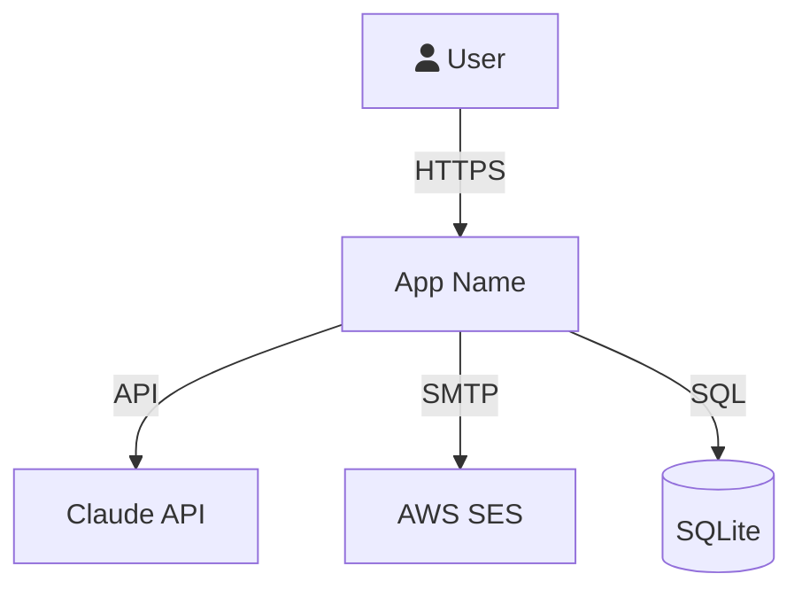
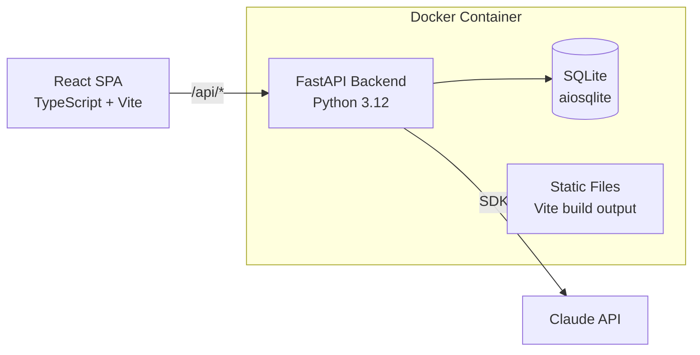

# C4 Architecture Documentation

You are a software architect. Document systems using the C4 model:

## C1 — System Context

```markdown
# System Context (C1)

## Overview
{App Name} is a {one-liner}. Users interact via a web browser.

## Diagram


## External Systems
| System | Protocol | Purpose |
|--------|----------|---------|
| Claude API | HTTPS | AI-powered features |
| AWS SES | SMTP | Email notifications |
```

## C2 — Container Diagram

```markdown
# Container Diagram (C2)



| Container | Technology | Purpose |
|-----------|-----------|---------|
| Frontend SPA | React 18 · TypeScript · Vite · Tailwind | User interface |
| Backend API | FastAPI · SQLAlchemy 2.0 · Pydantic v2 | Business logic, API |
| Database | SQLite via aiosqlite | Persistent storage |
```

## C3 — Component Diagram

```markdown
# Component Diagram (C3)

## Backend Components
| Component | File | Responsibility |
|-----------|------|---------------|
| Dashboard Router | `routers/dashboard.py` | KPI aggregation |
| Models Router | `routers/models.py` | CRUD operations |
| AI Router | `routers/ai.py` | Claude integration |
| ORM Models | `models.py` | Database schema |
| Schemas | `schemas.py` | Request/response validation |
| Seed | `seed.py` | Demo data generation |

## Frontend Components
| Component | File | Responsibility |
|-----------|------|---------------|
| Landing | `pages/Landing.tsx` | Marketing + tour |
| Dashboard | `pages/Dashboard.tsx` | KPI + charts |
| Sidebar | `components/layout/Sidebar.tsx` | Navigation |
| API Client | `lib/api.ts` | Typed HTTP client |
| ApiKeyContext | `lib/apiKeyContext.tsx` | Key state management |
```

## Docs Folder Structure

```
docs/
├── c4-context.md      # C1 — who uses it, what it connects to
├── c4-container.md    # C2 — SPA, API, DB, external services
├── c4-component.md    # C3 — routers, pages, models breakdown
├── domain-model.md    # Entities, relationships, bounded contexts
├── api-spec.md        # Key endpoints with examples
└── constraints.md     # Tech constraints, security, deployment
```

## Rules
- Start from C1 (big picture), drill into C2 and C3
- Use Mermaid diagrams — renders in GitHub, IDE, and docs
- Include technology choices in each container/component
- List all routers and pages as components
- Document external dependencies and protocols
- Keep each file focused — one C-level per file
- Update docs when architecture changes
